# vk-bootstrap-triangle

## 1. triangle with vk-bootstrap + push constants

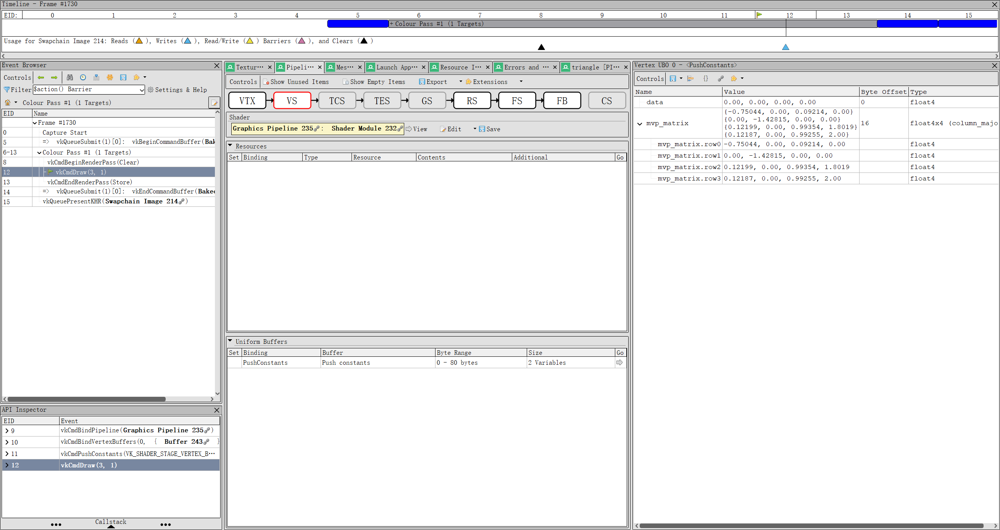

## 2. dynamicRendering + synchronization2

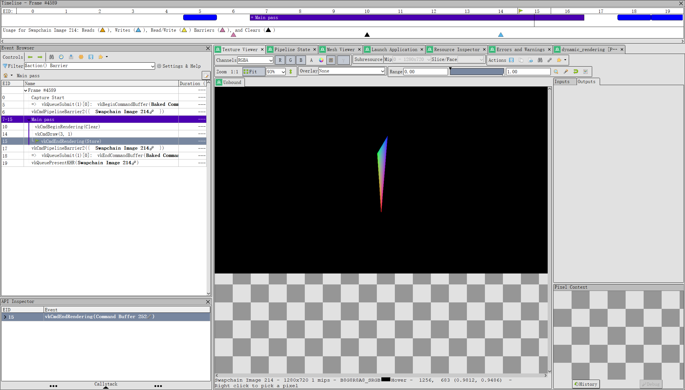

## 3. mesh shader

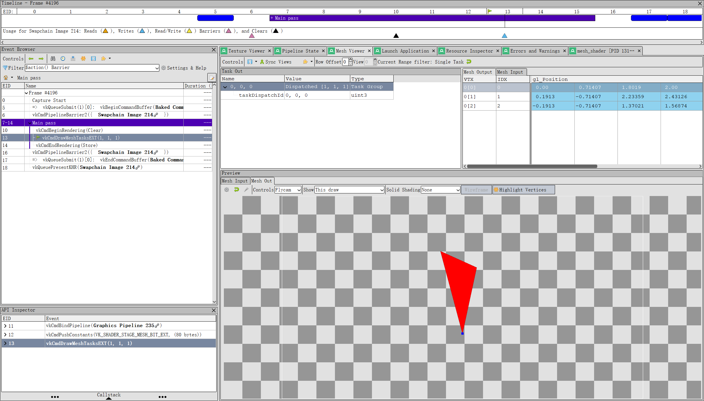

## 4. imgui

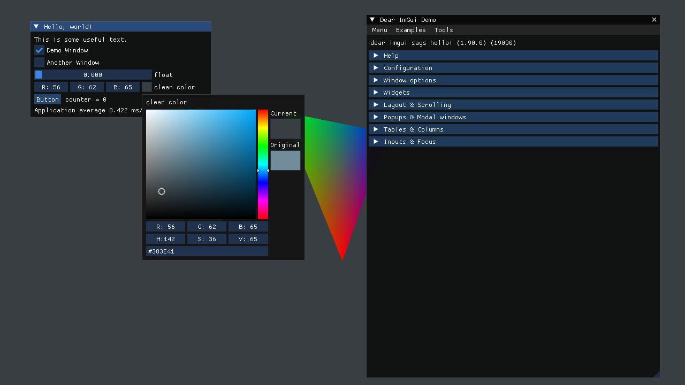

## 5. ozz-animation + VK_KHR_push_descriptor

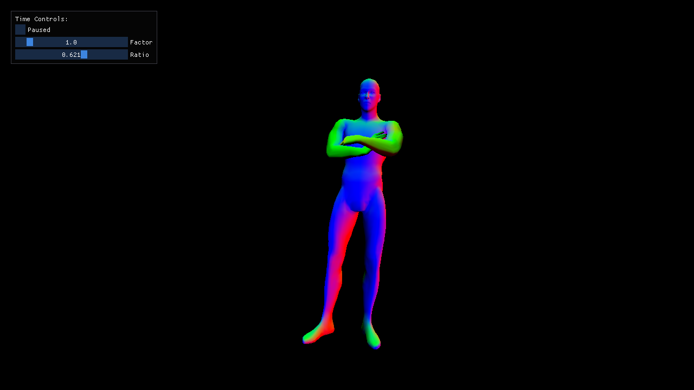

## 6. pbr

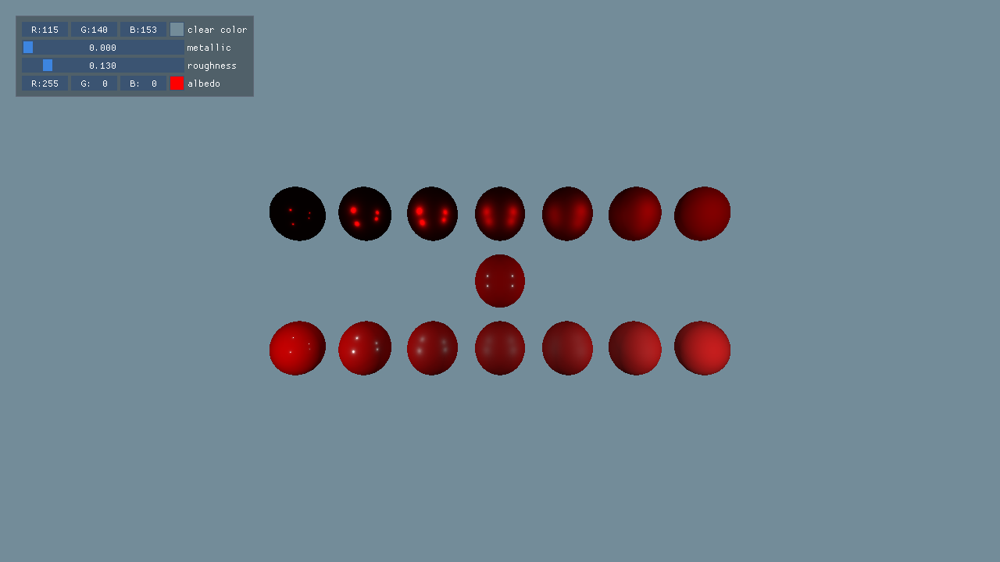

## 7. ibl

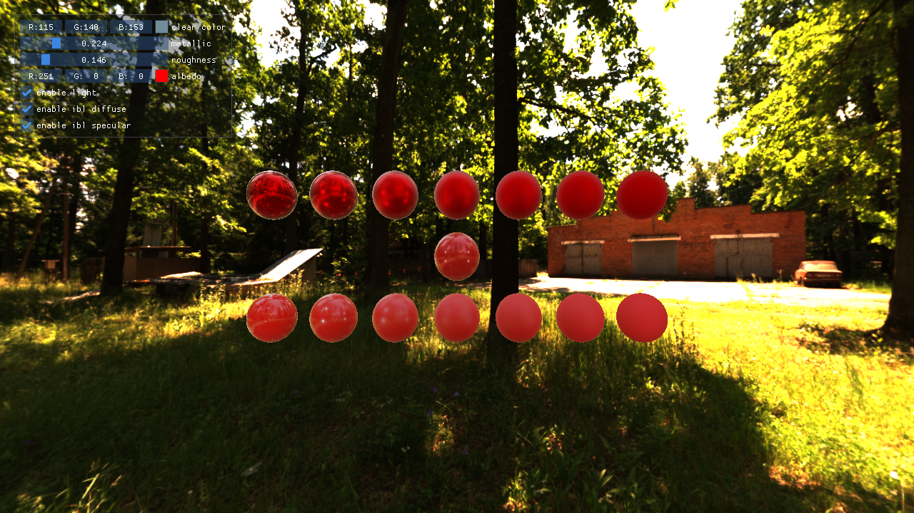

## 8. buffer device address

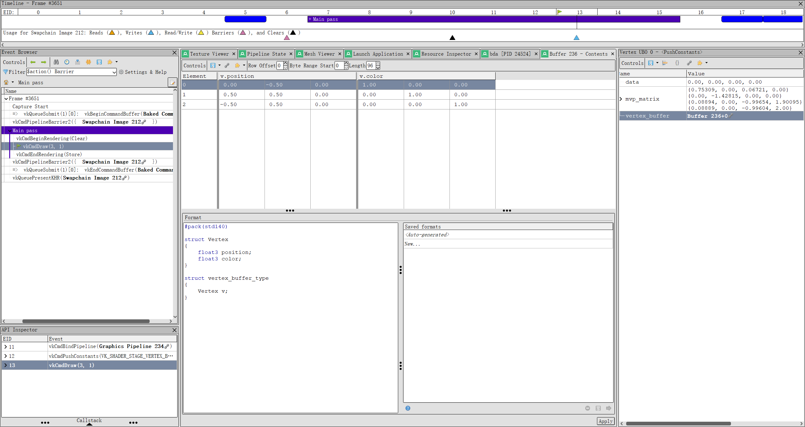

```glsl
// ...
struct Vertex
{
    vec3 position;
    vec3 color;
};

layout(buffer_reference, std430, buffer_reference_align = 32) buffer vertex_buffer_type {
    Vertex v;
};

layout(push_constant) uniform constants
{
    // ...
    uint64_t vertex_buffer_address;
} PushConstants;

void main ()
{
    vertex_buffer_type vertex_buffer = vertex_buffer_type(PushConstants.vertex_buffer_address);
    vec3 inPosition = vertex_buffer[gl_VertexIndex].v.position;
    vec3 inColor    = vertex_buffer[gl_VertexIndex].v.color;
    // ...
}
```

or

```glsl
layout(push_constant) uniform constants
{
    //...
    // for renderdoc support
    vertex_buffer_type vertex_buffer;
} PushConstants;

void main ()
{
    vec3 inPosition = PushConstants.vertex_buffer[gl_VertexIndex].v.position;
    vec3 inColor    = PushConstants.vertex_buffer[gl_VertexIndex].v.color;
    //...
}
```

## 9. gltf + bindless (descriptor indexing)

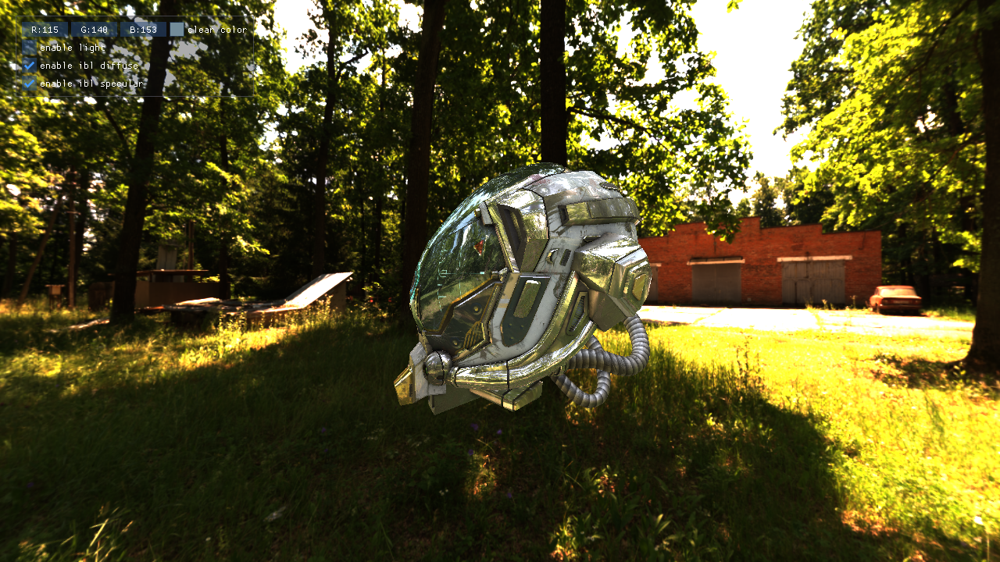

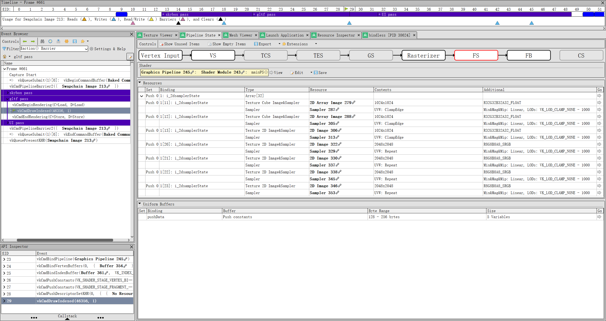

> push descriptor only supporting up to 32 descriptors

## 10. timeline semaphore

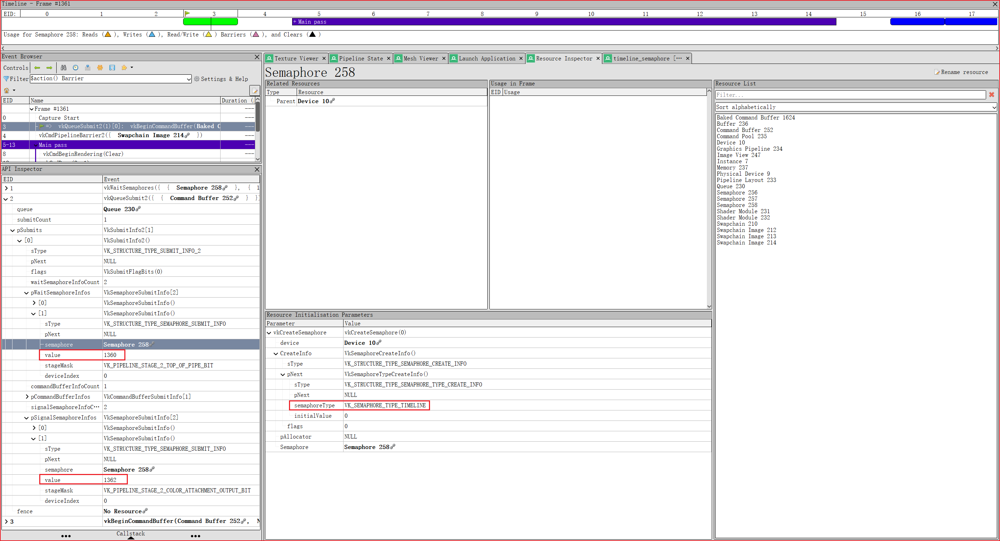
